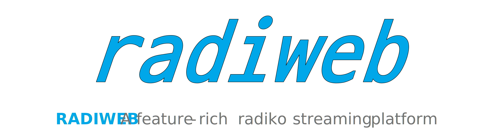
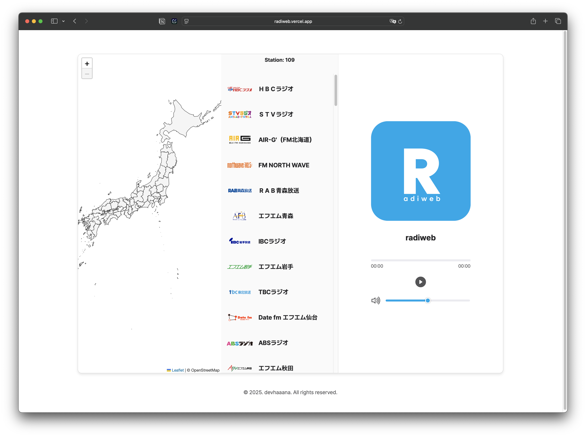

  

  
  
  
  

 

[ENGLISH](/README.md)  ·  [한국어](/documents/README-KR.md)  ·  [日本語](/documents/README-JP.md)

 

`radiweb` is a web-based application for streaming broadcasts from [radiko.jp](https://radiko.jp/), a Japanese radio service, outside of Japan.

## Index

- [Index](#index)
- [Warning](#warning)
- [Technologies](#technologies)
- [Technical Details](#technical-details)
- [Getting Started](#getting-started)
  - [Usage](#usage)
- [Release Files](#release-files)
- [Reference](#reference)

## Warning

**Please do not use this project for commercial use. Only for your personal, non-commercial use.**

## Technologies

- `HTML`
- `CSS`
- `JS`

## Technical Details

The authentication of PC(html5) version radiko validates user's location via IP address.
However, the android version of radiko validates user provided by GPS information, not via user's IP address.

## Getting Started

### Usage

Visit the following link to use Covify in your browser:

[https://radiweb.vercel.app/](https://radiweb.vercel.app/)

## Release Files

| File                                                                                    | Description                                                        |
| :-------------------------------------------------------------------------------------- | :----------------------------------------------------------------- |
| [radiweb-1.0.0.zip](https://github.com/devhaaana/radiweb/archive/refs/tags/v1.0.0.zip)       | A*ZIP* file containing the full source code of radiweb v1.0.0.    |
| [radiweb-1.0.0.tar.gz](https://github.com/devhaaana/radiweb/archive/refs/tags/v1.0.0.tar.gz) | A*TAR.GZ* file containing the full source code of radiweb v1.0.0. |

## Reference

- [rajiko](https://github.com/jackyzy823/rajiko)
- [radiko-downloader](https://github.com/devhaaana/radiko-downloader.git)

 
